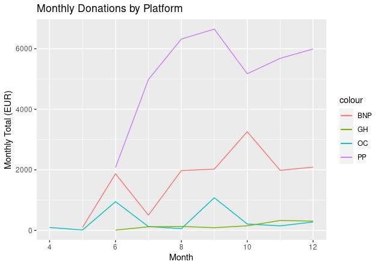
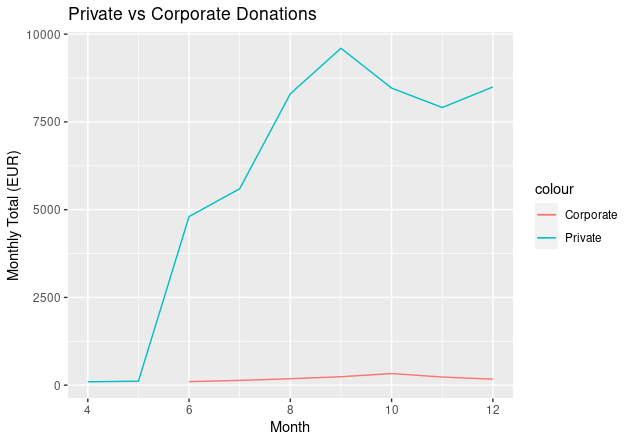
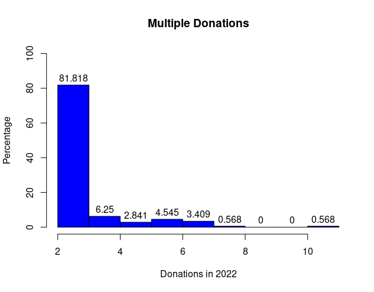

# FreeCAD Project Association 2022 Annual Report

## Message from the chair

The first full year of of operation for the [FreeCAD project association (FPA)](https://fpa.freecad.org) has been busy and full of achievements.  I am thrilled and optimistic for the future of the association.

The FPA was born out of the actions of a few veteran FreeCAD developers and community members. The majority of the FreeCAD community was not involved in its creation and initial set up, therefore, the FPA needed and still needs to gain trust and legitimacy from that community. We do this mainly through being transparent in everything the FPA does. This focus on transparency starts right from the [FPA statutes](https://fpa.freecad.org/handbook/corporate/statutes.html), which define the role of the FPA as a tool to be used by and to benefit the whole FreeCAD community.

It seemed simple.  After all, we have been working together for quite some time.  It turns out that operating in an official and accountable environment like the FPA, where you are literally handling other people's money, is not so simple.  Decisions become very important, as are the ways these decisions are made.  Everything needs to be transparent and justifiable.

We had some setbacks at first.  We realized our voting system was preventing us from moving forward, but we learned to solve the issues and put things back on track.  Now the FPA internals are really working well, and we are able to reach consensus very easily and quickly on most issues.

The administrators and members of the FPA would like to thank all of you who put trust in it right from the start, donated to the project, and helped FreeCAD to go further and faster. 

## 2022 Highlights

### Initial setup of the FPA

The FPA was formally created in November 2021 as a Belgium-based [AISBL](https://justice.belgium.be/fr/themes_et_dossiers/societes_associations_et_fondations/associations/aisbl) (international non-profit association)  It began operation in February 2022. The initial setup involved writing the association [statutes](https://fpa.freecad.org/handbook/corporate/statutes.html) and obtaining a [royal decree](https://fpa.freecad.org/royal_decree.pdf) that gave official birth to the association. The association was then [registered](https://kbopub.economie.fgov.be/kbopub/toonondernemingps.html?lang=en&ondernemingsnummer=781867807) and a bank account was opened. Accounts on different donation platforms were then also created, and the [FreeCAD website](https://freecad.org) was updated to inform users of the new donation possibilities.

Everything we learned about setting up and running an AISBL has been [documented](https://fpa.freecad.org/handbook/corporate/aisbl_guide.html). We hope this can help other Free and Open-Source (FOSS) projects to take a step further and create a formal structure for it.

### FPA Development Fund

The [FPA Development Fund](https://fpa.freecad.org/programs/fpadf-announcement) was established and made its first grant in September 2022. The fund provides grants to developers for work on the FreeCAD code base. Almost €2,500 was awarded in 2022.

### The FreeCAD Blog

An [official FreeCAD blog](https://blog.freecad.org) was added to the main FreeCAD website in 2022. The blog provides insight into FreeCAD development, information about how people use FreeCAD and reaches community members beyond the [FreeCAD forum](https://forum.freecad.org).  A [grant program](https://fpa.freecad.org/programs/blog-content) for blog content was established in late 2022.  Community members can receive a small grant for creating original blog content.

### FOSDEM and FreeCAD meeting 2023

Meeting in real-life is something that is very important and fruitful, as any contributors to open-source projects who have experienced it will confirm. Many new ideas start during these meetings. It is also a kind of reward: after having worked together for a long time, it is always nice to put faces on names.

In 2022, the FPA was busy preparing for the [2023 Free and Open Source Developers’ European Meeting (FOSDEM)](https://fosdem.org).  Arrangements for a [FreeCAD meeting day](https://fpa.freecad.org/programs/freecad-day-2023) on the Friday immediately preceeding FOSDEM began late in 2022.

A [grant program](https://fpa.freecad.org/programs/fosdem-travel-grants) was established to help defray travel costs for attendees.

### Branding

The FPA acquired control of the [freecad.org](https://freecad.org) domain, which was generously donated to the FreeCAD community by the [KiCAD Services Corp.](https://www.kipro-pcb.com/). The FPA also registered a FreeCAD [trademark](https://fpa.freecad.org/trademark.pdf).  These steps protect the FreeCAD brand.

### New members

The FPA [roster](https://fpa.freecad.org/handbook/people/roster.html) has expanded. More people have joined the FPA, and people have started assuming different roles and positions. So far the arrival of new members has been spontaneous, without much regulation or direction, but as the FPA grows this is a question that is under discussion.

### Administration team

The FPA administration team expanded to four members in 2022 and is now working at full power. The team maintains a weekly video meeting and no week passes without several tasks being done. Everything learned or set up is being documented in the [FPA handbook](https://fpa.freecad.org/handbook). The handbook covers everything about how the FPA is organized and operated, and serves as a reference for people both inside and outside the FPA.

## Plans for 2023

We expect 2023 to be even busier than 2022.  Some of the things we hope to accomplish in 2023 are:

* **Enable the FPA to engage in commercial operations** and deduct VAT. The FPA has up to now been exempt from VAT registration, because it operates only on donations. In 2023, we want to enable the FPA to sign contracts and sell services, so it can act as an intermediary and make it easier for companies to contract FreeCAD developers. The VAT registration will enable the FPA to do so, and provide it with a VAT number, which allows it to pay less taxes when buying services and products in the EU.

* **Hire an accountant** to handle Belgian reporting requirements, such as tax returns and VAT handling. Up to now, the FPA members have done all the accounting tasks themselves. Hiring an external accountant, however, will help to ensure that the FPA makes no accounting or tax errors, and will allow the FPA to keep functioning even in case of large changes among FPA members.

* Based on 2022 donations and recent trends, **our expected income in 2023 is around €75,000**. A more detailed analysis is available below. A stable income will allow the FPA to launch more ambitious programs, take on more recurring expenses and provide developers more stability.

* **Expand the FPADF grant program** to a larger amount (€2,000 or €2,500). The [FPA's development fund program](https://fpa.freecad.org/programs/fpadf-announcement) has already distributed a few grants in 2022, but not as many as we would have liked. The good financial situation of the FPA will allow us to offer larger grants in order to attract more developers to the program.

* An **expanded grants system** for tasks proposed by the community, modelled on the Google Summer of Code (GSOC) program. Side by side with the FPADF program, the FPA wishes to launch a different kind of funding program for tasks that the FPA or the FreeCAD community finds necessary, and that the FPA could help "make happen". This should work on a similar model as the GSOC program, where students and other developers from outside the FreeCAD community are invited to work on an issue, and are funded by the FPA and mentored by the FreeCAD community.

* **Fund other specific projects**. FreeCAD has a couple of long-time issues outside of the FreeCAD code itself, that the FPA could help make happen. In 2023, the FPA hopes to build precise requirements to solve these issues, and seek and fund developers interested in solving them. Among these are the development of **a new documentation system** to host the FreeCAD documentation, and a new **parts library system**, able to cope better with the growing size of the current parts library.

* **Establish a reserve fund** to protect against unplanned expenses.

* Expand FPA to **FreeCAD communities outside the forum**. The [FreeCAD forum](https://forum.freecad.org) has been the place where the FreeCAD community meets, discusses issues and builds FreeCAD. More and more, however, these activities happen outside the forum, for example directly on GitHub, or in Reddit or Facebook communities. In 2023, the FPA will work to improve its outreach to these other communities, and make their contribution to the FreeCAD universe more visible and accessible.

## Financial Report

In 2022, the FPA received donations in excess of **€50,000**, an amount that far exceeds our [expectations](https://fpa.freecad.org/budgets/2022.html). The donations came almost entirely from individuals, but a few companies also contributed. Most of our donations are small (~€5) one-time contributions.  A number of supporters have arranged for recurring donations, amounting to about **€500** per month.

In 2022, bookkeeping for the FPA was done in [simple table form](https://fpa.freecad.org/reports/2022). Starting in 2023, bookkeeping will be done in a more complete, double-entry system using the open-source [GnuCash](https://gnucash.org/) application. Monthly reports will continue to be issued by the administration team.

The FPA is funded by donations from individuals and corporations.  We use four main platforms to collect donations:

* direct deposits to our bank account
* transfers to our PayPal account
* Github donations
* donations via Open Collective.

The FPA also maintains a BountySource account, but there is little activity on this account.

The following charts illustrate that the vast majority of FPA funding comes from small donations by individuals.  Less than 5% of our supporters made more than 1 donation in 2022.

The FPA engaged in a few recurring engagements in 2022, namely subscriptions to services and platforms.

* table: recurring payments
* ??WF: the only recurring payment I know of is USD10/month to codeberg.  Everything else is paid by the year, no?

### Debts

By the end of 2022, all debts related to the setup of the association were settled, and the FPA in now completely debt free.

### Non-financial Assets

The FPA owns the [freecad.org](https://freecad.org) domain and and a [trademark](https://fpa.freecad.org/trademark.pdf) that helps us to protect the FreeCAD name and logo against unfair or malicious use.

### Financial Statements

* [Balance sheet](2022YearEndBalanceSheet.md)

* [Income statement](2022IncomeStatement.md)

### 2023 Budget Estimate

* Income
  * We expect our 2023 income to be slightly higher than 2022, since we will be receiving donations for a full 12 months.  If corporate sponsorship increases, our income could go up significantly.

* Expenses
  * We expect to spend much more of our income in 2023 and to spend much of our existing funds:
    * FPADF - €50,000
    * Event support - €10,000
    * Reserve fund - €20,000
    * Infrastructure - €5,000
